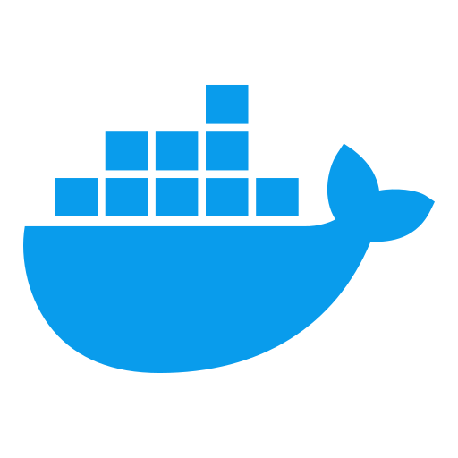

<h1 align="center">Hi 👋, I'm Kellan</h1>
<h3 align="center">I a Software Developer currently learning Laravel Livewire. I'm passionate about DevOps and backend development and solving problems with technology. Outside of tech I love running, hiking, photography & videography. <a href="https://wethinkcode.co.za">WeThinkCode_ </a> alumni.</h3> 

- 🌱 I’m currently learning **Laravel, Livewire, MySQL and Nginx**.

- 💬 Ask me about **my homelab and my experience in full stack development**.

- 👨‍💻 I have done projects with **PHP, Laravel, MySQL, Docker, Kubernetes, Nginx, Proxmox, HomeAssistant and more**.

<h3 align="left">Connect with me:</h3>

  
  

<h3 align="left">Languages and Tools:</h3>

 
  
  
  
  
  
  
  
  
  
  
  
  
  
  

